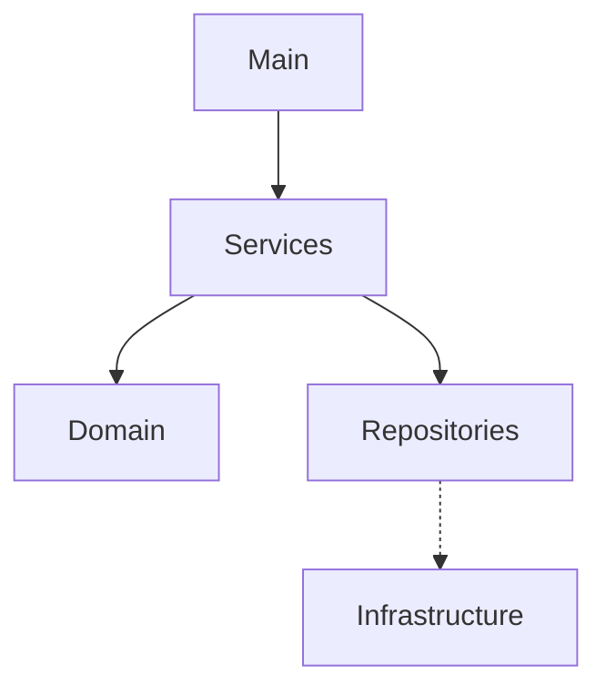

# Gerenciador de Milhas — Controle simples de programas de fidelidade

[](LICENSE)


> Aplicativo demonstrativo para gerenciar saldos, movimentos e resgates de *milhas* em programas de fidelidade. Feito para estudo e uso pessoal — foco em arquitetura clara e código fácil de entender.

---

## O que é este projeto

O **Gerenciador de Milhas** é uma solução didática que reúne operações básicas que alguém precisaria para controlar pontos e milhas acumuladas em programas de fidelidade: cadastrar programas, registrar créditos/débitos, simular resgates e acompanhar validade/expiração.

O objetivo principal não é reproduzir a complexidade dos sistemas reais de companhias aéreas, mas sim demonstrar boas práticas de separação de camadas, testes e estruturação do domínio.

Passado como requisito da disciplina de *Programação WEB I*, sob orientação do professor *George Leite*. Alunos integrantes: *Juan Wesley, Vicente Gabriel e Welber Sauan*. Bacharelado de Sistema de Informações, IFS - Campus Lagarto.

---

## Funcionalidades principais

* Cadastro de **programas de fidelidade** (nome, parceiro, regras básicas).
* Gerenciamento de **contas de usuário** vinculadas a programas.
* Lançamentos de **crédito** e **débito** de milhas com data e observações.
* **Relatórios** de saldo por programa, histórico de transações e alertas de milhas perto da expiração.
* **Simulação de resgate**: checar se um resgate hipotético é possível com o saldo atual.

---

## Arquitetura e organização do código

O projeto segue uma organização modular e limpa, com separação entre camada de domínio, casos de uso e infraestrutura (adaptadores). Isso facilita trocar a persistência (hoje em memória ou arquivos) por um banco de dados real no futuro.

* **Domain** — Entidades como `Programa`, `Conta`, `Lancamento` e regras de negócio (ex.: cálculo de saldo, verificação de validade).
* **Use Cases / Services** — Operações coordenadas (criar conta, lançar crédito, gerar relatório de expiração, simular resgate).
* **Repositories / Adapters** — Implementações concretas para armazenamento; por padrão há uma versão leve em memória.
* **Interface / Main** — Uma pequena interface (CLI/GUI) ou classe `Main` para demonstrar os fluxos básicos.

Diagrama simplificado:



---

## Como rodar (modo rápido)

1. Clone o repositório:

```bash
git clone https://github.com/vicentegabriells/gerenciador-milhas.git
cd gerenciador-milhas
```

2. Abra em sua IDE (IntelliJ, Eclipse, VS Code) ou use o gerenciador de build presente (Maven/Gradle) caso exista.
3. Localize a classe principal (`Main` ou equivalente) e execute-a.

Se o projeto usar Maven:

```bash
mvn clean package
mvn exec:java -Dexec.mainClass="com.seu.pacote.Main"
```

Se usar Gradle:

```bash
./gradlew run
```

> Observação: se não houver um `pom.xml` ou `build.gradle` na raiz, basta rodar a classe principal pela IDE.

---

## Cenários de uso (exemplos)

* Inserir um novo programa de fidelidade (ex.: `AzulFlyer`).
* Criar uma conta para o usuário `João` no programa `AzulFlyer`.
* Registrar 3 lançamentos de crédito (voos, compras) e 1 débito (resgate).
* Gerar relatório: "Milhas que expiram nos próximos 30 dias".
* Simular um resgate e apresentar mensagem clara se o saldo é suficiente.

---

## Boas práticas adotadas

* Regras de negócio centralizadas no domínio.
* Interfaces (ports) para repositórios, facilitando testes e trocas de implementação.
* Código organizado em pacotes/co-responsabilidades para facilitar leitura.
* Mensagens e retornos claros em casos de validação (saldo insuficiente, dados inválidos).

---

## Pontos de melhoria

* Persistência real (banco de dados relacional ou NoSQL) com migrações.
* Autenticação básica se for abrir para uso multiusuário.
* Testes automatizados cobrindo edge cases (expiração de milhas, créditos retroativos, transações concorrentes).
* Integração com APIs externas (parceiros) para importar movimentos automaticamente.
* Interface web (Spring Boot + React/Vue) para tornar o uso mais amigável.

---

## Contribuindo

Contribuições são bem-vindas. Se quiser colaborar, siga este fluxo:

1. Abra uma *issue* descrevendo o que pretende alterar.
2. Faça um *fork*, crie uma branch com escopo claro e envie um *pull request* com descrição e testes quando aplicável.

---

## Licença

O projeto pode estar licenciado sob MIT (verifique o arquivo `LICENSE`).

---

## Contato

Se quiser trocar ideias, propor melhorias ou pedir ajuda para ajustar o README (tom, badges, exemplos reais de uso), abra uma issue ou me marque no GitHub: `@vicentegabriells`.

---

> Observação: escrevi esse README com linguagem natural e direta — se você quiser que eu gere uma versão em inglês, adicione instruções de execução mais técnicas (ex.: comandos exatos do Maven/Gradle) ou exemplos de saída esperada, eu adapto sem soar "robotizado".
